# lab 3
I pledge my honor that I have abided by the Stevens Honor System. Below is an overview of terminal commands. My MacOs terminal was used to perform this lab. Commands used are listed, followed by images of terminal window results.

# entering iot directory
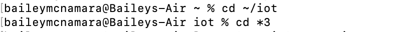

# installation of packages 
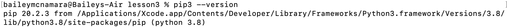
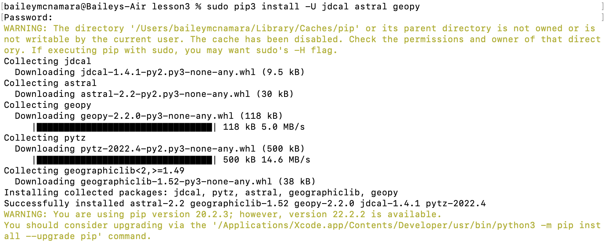

# today's julian calendar day
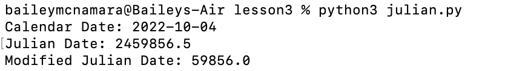

# today's date
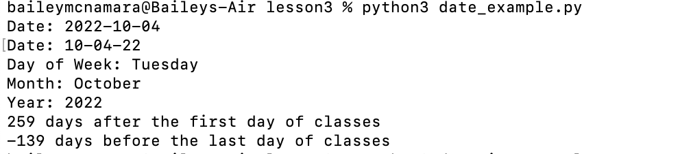

# today's date and current time
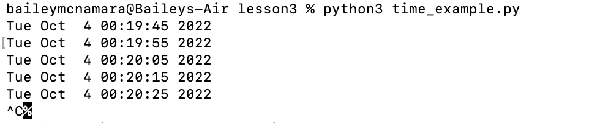

# current time, updates every 10 seconds

# checking sun status of New York today
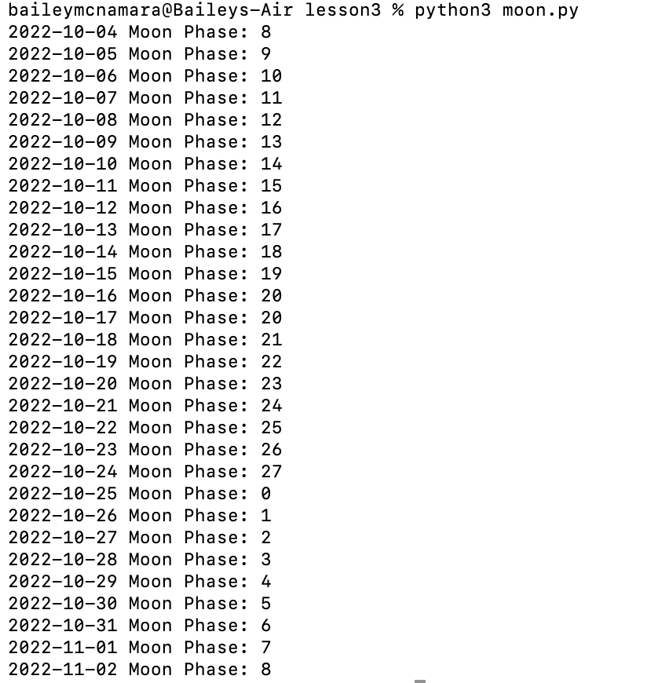

# the moon's phases (ends where the phases cycle all the way back to today's phase)
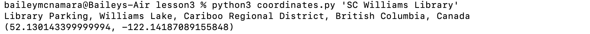

# exact location of the Stevens library
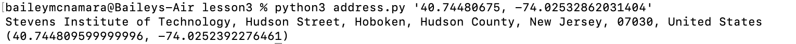

# receive address of given coordinates
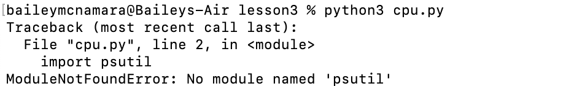

# check top 10 words used in a document
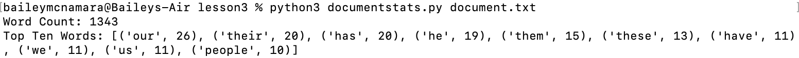
