# labs 1 and 2
# command line
I pledge my honor that I have abided by the Stevens Honor System. Below is an overview of terminal commands. My MacOs terminal was used to perform this lab. Commands used are listed, followed by images of terminal window results.
# hostname, env
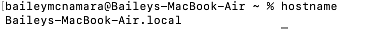
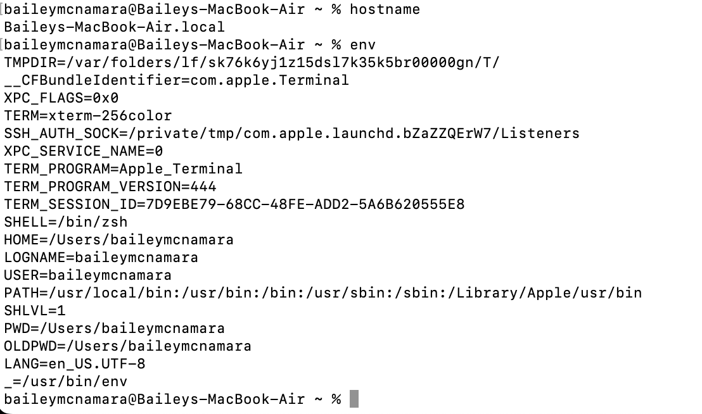
# ps, pwd
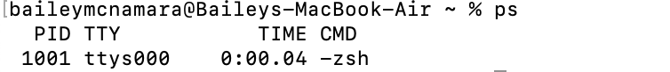

# git clone, cd iot, ls, cd, df
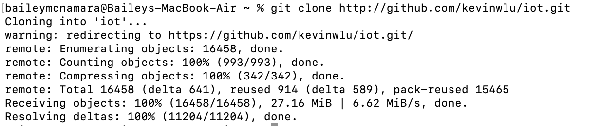

# mkdir demo, cd demo, nano file
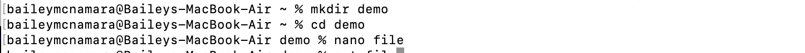
# nano file (editor)
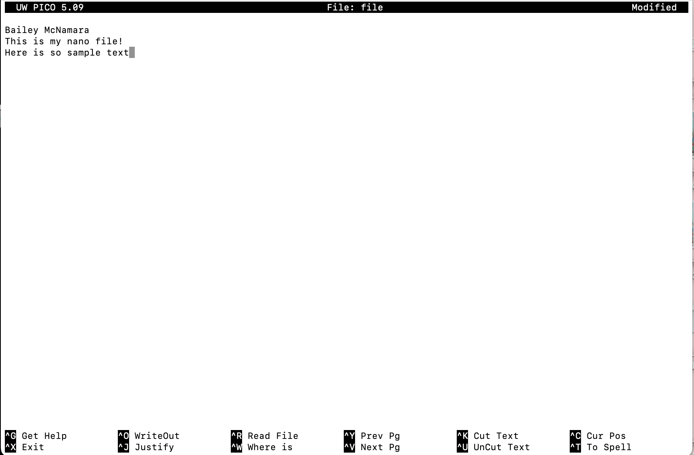
# cat file, cp file file1, mv file file2, rm file2

# man uname
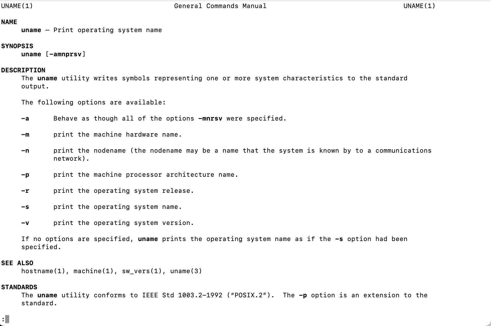
# uname -a, ifconfig
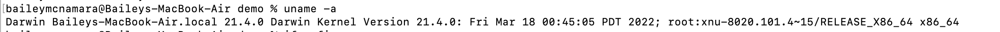
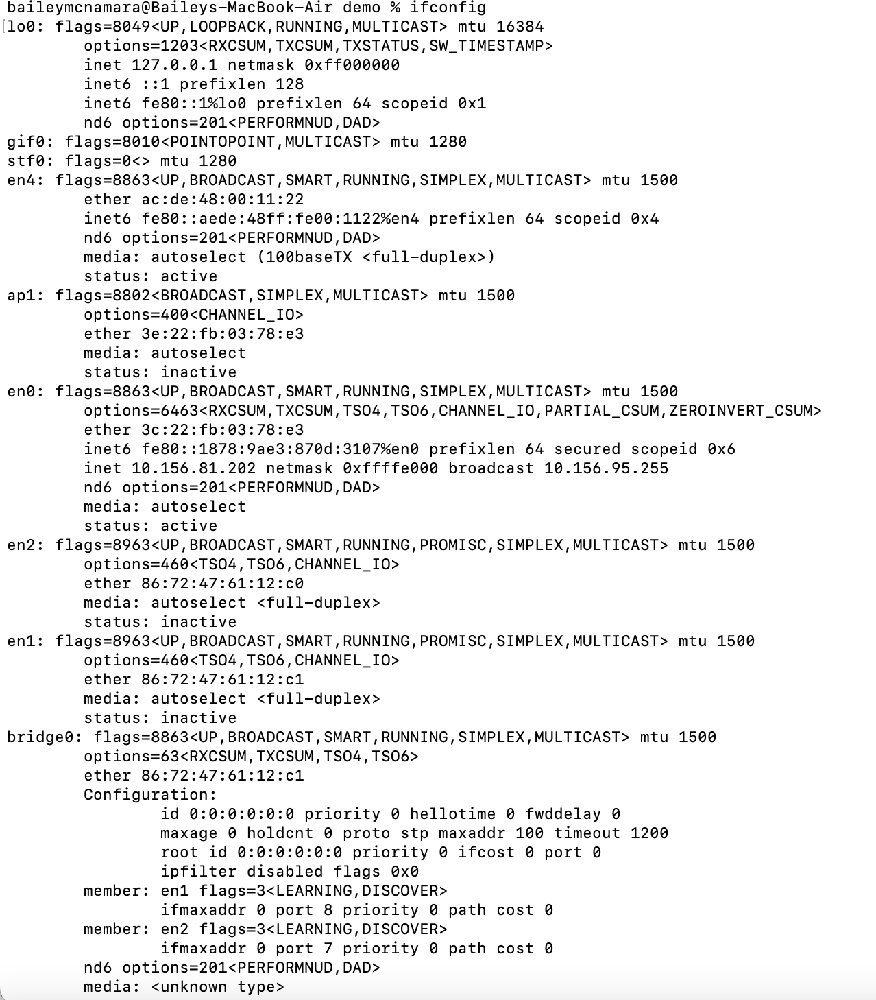
# ping localhost, ctrl+c
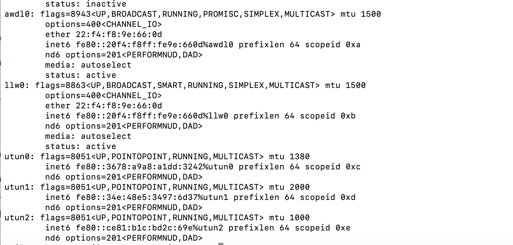
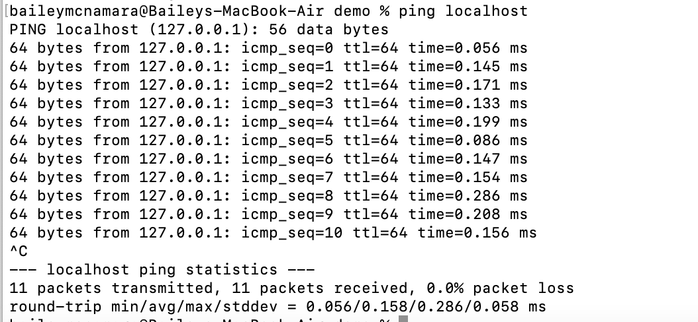
# netstat
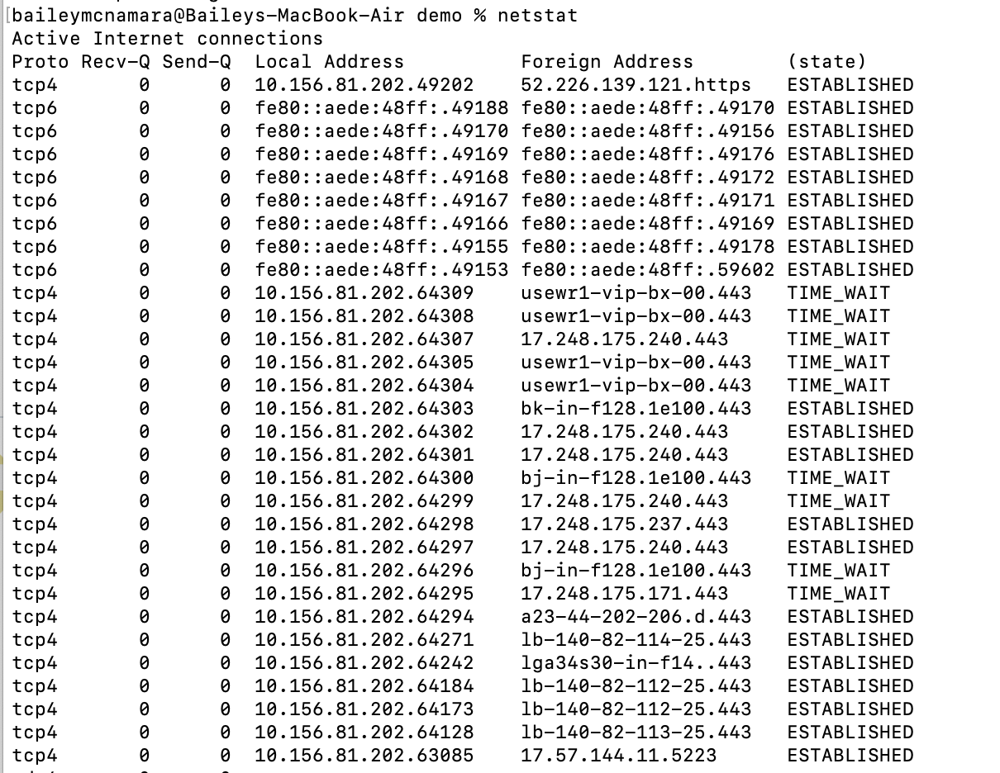
